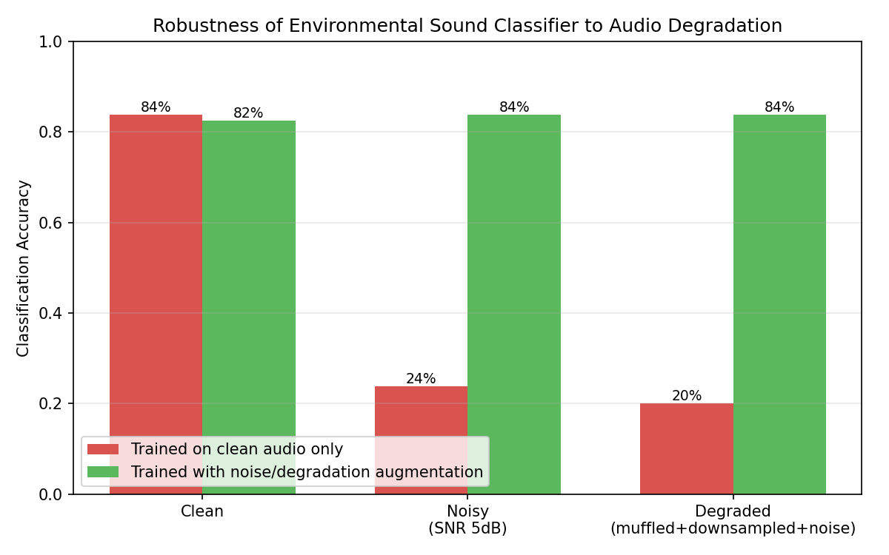

# Robust Environmental Sound Classifier

A weekend project exploring how audio recognition systems degrade under
real-world recording conditions, and how to diagnose and mitigate that
limitation — built on the [ESC-50](https://github.com/karoldvl/ESC-50)
environmental sound dataset.

## Problem

Audio recognition models are typically trained and benchmarked on clean
recordings. In deployment, however, audio arrives through cheap microphones,
background noise, walls, and lossy transmission. This project quantifies
that gap and tests a practical work-around.

## Method

**Dataset**: 8 ESC-50 classes (320 clips) spanning tonal sounds (siren,
clock alarm), broadband sounds (rain, vacuum cleaner) and transients (glass
breaking, door knock) — a mix chosen to stress-test different signal
characteristics.

**Features**: MFCCs (20 coefficients) plus spectral centroid, bandwidth,
rolloff, zero-crossing rate and RMS energy, pooled (mean/std) over each
clip into a fixed-length feature vector.

**Model**: Random Forest classifier (300 trees).

**Degradations simulated**:
- *Noisy*: additive white noise at 5dB SNR
- *Degraded*: low-pass "muffling" (3kHz cutoff) → downsample/upsample
  roundtrip (22kHz → 8kHz → 22kHz, simulating a cheap capture device) →
  additive noise — a compound, realistic worst case

**Mitigation**: data augmentation — each training clip is supplemented
with a noisy and a degraded copy, so the model learns degradation-invariant
features rather than only clean-audio patterns.

## Results

| Test condition | Trained on clean audio only | Trained with augmentation |
|---|---|---|
| Clean audio | 83.8% | 82.5% |
| Noisy (5dB SNR) | 23.7% | 83.8% |
| Degraded (muffled + downsampled + noisy) | 20.0% | 83.8% |

The baseline model — trained the conventional way, on clean audio only —
collapses to near-random performance (~20-24%, vs. ~12.5% chance level for
8 classes) the moment realistic noise or device limitations are introduced.
This is the central real-world limitation: a model that looks production-ready
on a clean benchmark can be almost unusable in deployment.

Augmenting the training set with degraded copies of the same clips fully
recovers performance (83.8% on both noisy and degraded test audio) with
negligible cost to clean-audio accuracy (-1.3 points). The model learns to
key on degradation-invariant structure (broad spectral shape, energy
envelope) rather than fine detail that noise destroys.

## What this demonstrates

- Practical signal processing: spectral filtering, resampling, SNR-controlled
  noise injection, MFCC/spectral feature extraction
- Diagnosing a real-world limitation through controlled, measurable
  degradation testing rather than assumption
- Devising and validating a concrete work-around (training-time augmentation)
- Clear quantitative reporting suitable for stakeholder communication

## Files

- `sound_classifier.py` — full pipeline (data loading, feature extraction,
  degradation simulation, baseline + robust model training, evaluation)
- `plot_results.py` — generates the comparison chart
- `results.json` — raw accuracy figures
- `results_chart.png` — visual summary

## Possible extensions

- Replace MFCC + Random Forest with a CNN on log-mel spectrograms
- Sweep SNR levels to characterise the degradation curve rather than a
  single noisy condition
- Test generalisation to *unseen* noise types (train on white noise,
  test on traffic/crowd noise) to probe whether the model is learning
  general robustness or overfitting to the specific augmentation
